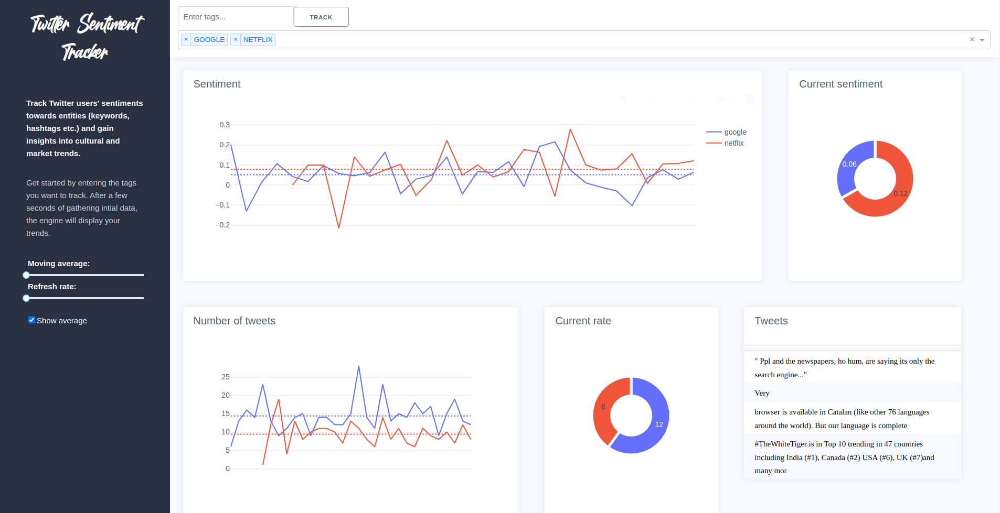
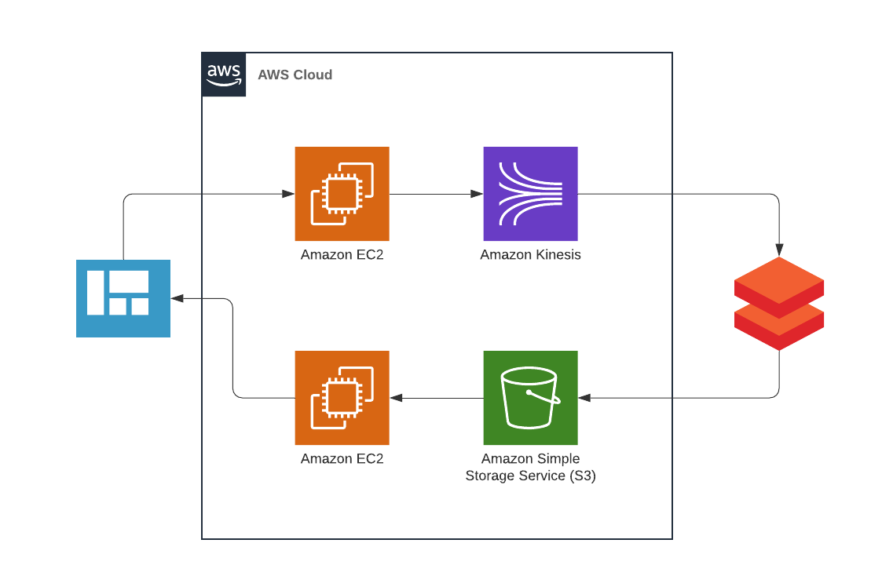

# Twitter Sentiment Tracker



A web-app to discover cultural and market trends by tracking sentiments towards key topics expressed on twitter. The app uses Twitter's filtered search API along with the textblob python library to extract tweets and analyze users' sentiments.


## Requirements

1. Python packages listed in requirements.txt. Can be installed by running `pip install -r requirements.txt`
1. A Twitter API Dev account
1. An AWS account (Kinesis not included in free tier, so some minor charges will be incurred)
1. A Databricks account (Free limited access through community edition)  

## How-to

As a first step the stream dispatcher (server app that starts twitter filtered streams) needs to be started. This can be achieved by simply running

```
python dispatcher.py
```

In a separate terminal the front-end can now be started with

```
python app.py
```
and accessed in any webbrowser under http://localhost:8080.

By default, the app is run in testing mode, which means that it simply displays sample data that is saved within the repository.

To actually track twitter streams four steps need to be taken:

1. Create an Amazon Kinesis stream and add its name to `config.py`
1. Create an Amazon S3 bucket and add its name to `config.py`
1. Create and start a databricks notebook, copy and paste the code contained in `databricks.py` into it
   and execute it. This will start the ETL workflow.
1. Set `TESTING=False` and fill the remaining empty fields in `config.py`, then restart the app

The app should now be able to track real-time tweets. Note that no data will be displayed until a first tag is created
from within the app.


## ETL pipeline



The web front-end in the form of a Plotly dashboard is hosted on an Amazon EC2 instance. At the same time, a flask server in charge of administrating active twitter streams is run on a separate EC2 instance. If a new tag is created on the web app, this server will start a corresponding stream which is then sent to and handled by Amazon Kinesis. To ensure scalability to data of high volume and velocity, the stream is ingested on the big data platform Databricks where the ETL workflow is handled by Apache Spark. In the course of this workflow, the following steps are taken:

1. relevant fields such as timestamp and textbody are extracted from the raw data

1. a user defined function (UDF) is applied to each tweet to assign a sentiment score. Internally, the UDF utilizes the text processing python library "textblob" which uses a pre-trained naive-bayes model.  
1. data is aggregated over a five second time window

1. the aggregated data containing the fields: timestamp, average number of tweets, average sentiment as well as sample tweets for every time-window is stored to a AWS S3 bucket in the form of a csv file.


The following Spark query is applied to the input stream

  <div class="input_area" markdown="1">

```python
  outDF = (kinesisDF
           .selectExpr("cast(data as string)")
           .withColumn('id', get_json_object(col("data"),"$[0].id"))
           .withColumn('ts', get_json_object(col("data"),"$[0].ts"))
           .withColumn('tweet', get_json_object(col("data"),"$[0].tweet"))
           .withColumn('tag', get_json_object(col("data"),"$[0].tag"))
           .withColumn('sentiment', getSentiment(col("tweet")).cast(FloatType()))
           .withColumn('datetime',
                     to_timestamp(regexp_extract( col('ts'), '\\w\\w\\w \\d\\d? (\\d+):(\\d+):(\\d+)',0),
                                  "MMM dd HH:mm:ss"))
           .select(col('sentiment'),col('datetime'), col('tag'), col('tweet'))
           .withColumn('sentiment_cnt', col("sentiment"))
           .withColumn('tweet_dup', col("tweet"))
           .groupBy(col("tag"), window(col('datetime'), "5 seconds").alias("timewindow"))
           .agg({'sentiment_cnt': 'count','sentiment':'avg','tweet':'first','tweet_dup':'last'})
           .withColumnRenamed("count(sentiment_cnt)","notweets")
           .withColumnRenamed("avg(sentiment)","avgsentiment")
           .withColumnRenamed('first(tweet)',"tweet1")
           .withColumnRenamed('last(tweet_dup)',"tweet2")
           .withColumn('timestamp',col("timewindow").cast("string"))
           .drop(col("timewindow"))
          )

```

  </div>

The stored csv file is read periodically (every five seconds) in order to populate the dashboard, creating a live-feed of twitter trends.
